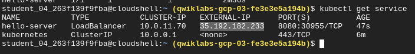

# Kubernetes Engine
## Task 1: Set a default compute zone
```bash
gcloud config set compute/zone us-central1-a
```
## Task 2: Create a GKE cluster
```bash
gcloud container clusters create [CLUSTER-NAME]
```
expected default output :
```bash
NAME: my-cluster
LOCATION: us-central1-a
MASTER_VERSION: 1.21.5-gke.1302
MASTER_IP: 34.69.232.119
MACHINE_TYPE: e2-medium
NODE_VERSION: 1.21.5-gke.1302
NUM_NODES: 3
STATUS: RUNNING
```
for customizing it -> https://cloud.google.com/sdk/gcloud/reference/container/clusters/create
## Task 3: Get authentication credentials for the cluster
```bash
gcloud container clusters get-credentials [CLUSTER-NAME]
```
## Task 4: Deploy an application to the cluster
To create a new Deployment hello-server from the hello-app container image, run the following [kubectl create](https://kubernetes.io/docs/reference/generated/kubectl/kubectl-commands#create) command:
--image diambil dari artifact registry atau container registry google yang sudah di push menggunakan docker
```bash
kubectl create deployment hello-server --image=gcr.io/google-samples/hello-app:1.0
kubectl get deployments
```
To create a Kubernetes Service, which is a Kubernetes resource that lets you expose your application to external traffic, run the following [kubectl expose](https://kubernetes.io/docs/reference/generated/kubectl/kubectl-commands#expose) command:
```bash
kubectl expose deployment hello-server --type=LoadBalancer --port 8080
```
To inspect the hello-server Service, run [kubectl get](https://kubernetes.io/docs/reference/generated/kubectl/kubectl-commands#get):
```bash
kubectl get service
```
To view the application from your web browser, open a new tab and enter the following address, replacing [EXTERNAL IP] with the EXTERNAL-IP for hello-server.

```bash
http://[EXTERNAL-IP]:8080
```

## Task 5: Deleting the cluster
Deleting the cluster can take a few minutes. For more information on deleted GKE clusters, view the [documentation](https://cloud.google.com/kubernetes-engine/docs/how-to/deleting-a-cluster).
On cloud :
```bash
kubectl get service -o wide
gcloud container clusters delete [CLUSTER-NAME]
```
On local :
Get all available services Then you can delete any services like this:
```bash
kubectl get service -o wide
kubectl delete svc <YourServiceName>
```
[>sumber belajar<](https://www.cloudskillsboost.google/focuses/878?parent=catalog)
